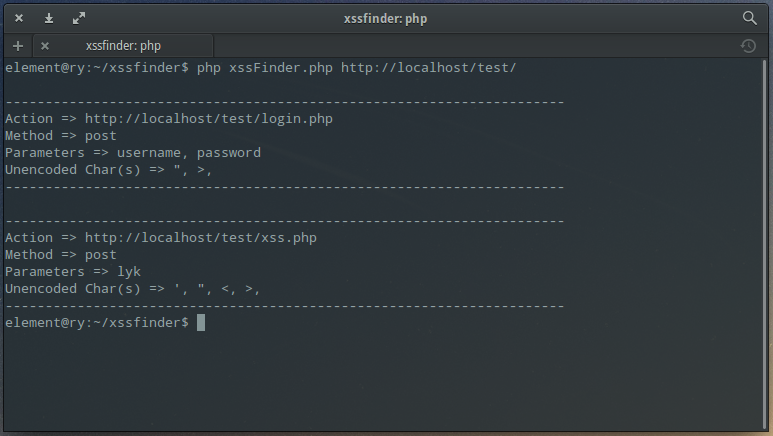

# xssFinder

### info
xssFinder is a simple example  written for the "Tool Development". xssFinder is a written at  [Linux Summer Camp 2016 event.](https://kamp.linux.org.tr/2016/)

### requirements

> php >= 5.3

if PHP is not installed;

```sh
$ sudo apt-get install php5-cli
```

### usage
```sh
$ git clone https://github.com/Om3rCitak/xssFinder.git
$ cd xssFinder
$ php xssFinder.php "http://omercitak.com/"
```

### result


Detail: [http://omercitak.com/xssfinder-xss-tespit-araci/](http://omercitak.com/xssfinder-xss-tespit-araci/)
